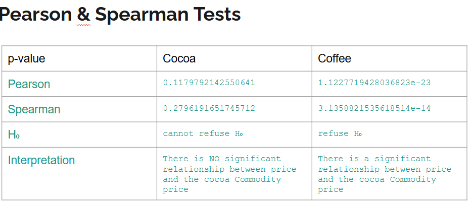

# data-wrangling-project

### Kanban Board:
https://trello.com/b/FmFvIu4b/data-wrangling-project

### Presentation:
https://docs.google.com/presentation/d/1h6DldSIaLFDkNmmYLW-nCqdujPzXiyRdRX_-lEj8_5M/edit?usp=sharing

### Sources:
Yahoo finance api for commodity price Cocoa (“CC=F”) and Coffee (“KC=F”)
Kaggle Dataset for coffee sales in a coffee shop
https://www.kaggle.com/datasets/ayeshasiddiqa123/coffee-dataset

H₀: There is no relationship between the price in the shop and the cocoa Commodity price.
H₁: There is a significant relationship between price  in the shop and the cocoa Commodity price.
